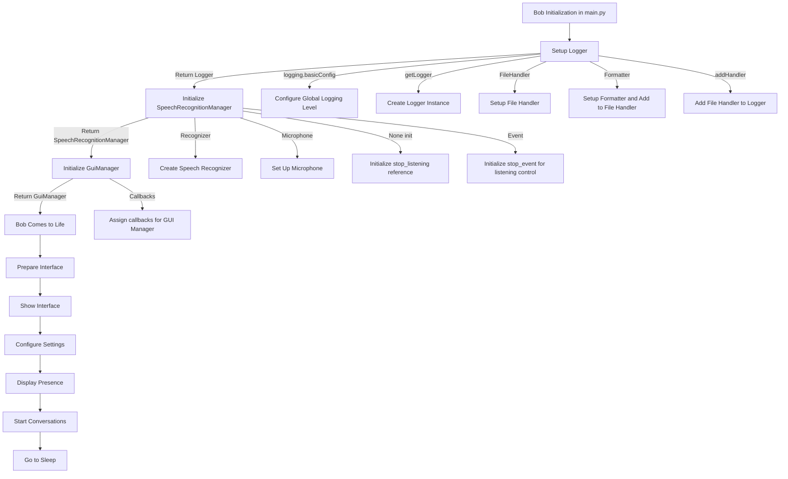

# bob

## Bob's Lifecycle and Function Call Flow

- `Bob()` (`__init__(self)`) [main.py -> bob.py]
    - Initializes the Bob instance.
    - Sets up logging for Bob's activities.
    - `setup_logger()` (`setup_logger(name='Bob', level=logging.DEBUG, filename='bob.log')`) [bob.py -> logger_manager.py]
        - Configures logging to have the DEBUG level by default.
            - `logging.basicConfig(level=level)`
        - Creates a logger with the name 'Bob'.
            - `logger = logging.getLogger(name)`
        - Sets up a file handler to write logs to 'bob.log'.
            - `file_handler = logging.FileHandler(filename)`
        - Defines the format for log messages.
            - `formatter = logging.Formatter('%(asctime)s - %(name)s - %(levelname)s - %(message)s')`
        - Applies the formatter to the file handler.
            - `file_handler.setFormatter(formatter)`
        - Adds the file handler to the logger.
            - `logger.addHandler(file_handler)`
        - Returns the configured logger.
            - `return logger`

- `SpeechRecognitionManager()` (`__init__(self, transcript_callback, logger)`) [bob.py -> speech_recognition_manager.py]
    - Initializes speech recognition capabilities.
        - Initializes the recognizer and microphone.
            - `self.recognizer = sr.Recognizer()`
            - `self.microphone = sr.Microphone()`
        - Sets a variable to keep the background listener reference.
            - `self.stop_listening = None`
        - Stores the callback for processing recognized audio.
            - `self.transcript_callback = transcript_callback`
        - Initializes the event to signal when to stop listening.
            - `self.stop_event = Event()`

- `GuiManager()` (`__init__(self, start_listening_callback, stop_listening_callback, command_callback)`) [bob.py -> gui_manager.py]
    - Initializes the GUI manager with specified callbacks.
        - Stores the callback function to start listening.
            - `self.start_listening_callback = start_listening_callback`
        - Stores the callback function to stop listening.
            - `self.stop_listening_callback = stop_listening_callback`
        - Stores the callback function to send commands.
            - `self.command_callback = command_callback`

## Bob's Actions to Come to Life

- `come_to_life()` [bob.py]
    - Sequence of method calls to initiate Bob's interactive session.
    - Prepares the backend for the interface.
        - `prepare_interface()`
            - Creates a context necessary for the GUI operation.
                - `dpg.create_context()`
    - Reveals the interface visually to the user.
        - `show_interface()`
            - Establishes a viewport that will be the window for the GUI.
                - `dpg.create_viewport()`
    - Configures settings for Bob's GUI.
        - `configure_settings()`
            - Applies configured GUI settings before rendering.
                - `dpg.setup_dearpygui()`
    - Displays Bob's GUI and prepares for interaction.
        - `display_presence()`
            - Constructs the visual layout for Bob using `GuiManager`.
                - `self.gui_manager.setup_gui()`
            - Shows the organized interface on the screen.
                - `dpg.show_viewport()`
    - Starts the GUI main loop for interaction.
        - `start_conversations()`
            - Starts the event loop to respond to user interactions.
                - `dpg.start_dearpygui()`
    - Cleans up resources and ends Bob's interaction session.
        - `go_to_sleep()`
            - Destroys the GUI context to close the application cleanly.
                - `dpg.destroy_context()`

---

# Bob - The Virtual Assistant

This document outlines the workflow and structure of the Bob virtual assistant application.

## Workflow Description

Bob is initialized in `main.py` where his life begins. The initialization process sets up logging, initializes speech recognition with callback functions, and prepares the GUI. Once Bob is set up, he is brought to life, which involves preparing his interface, making it visible, configuring it, displaying the GUI, starting the main loop for conversations, and eventually shutting down.

## Code Flow Diagram

