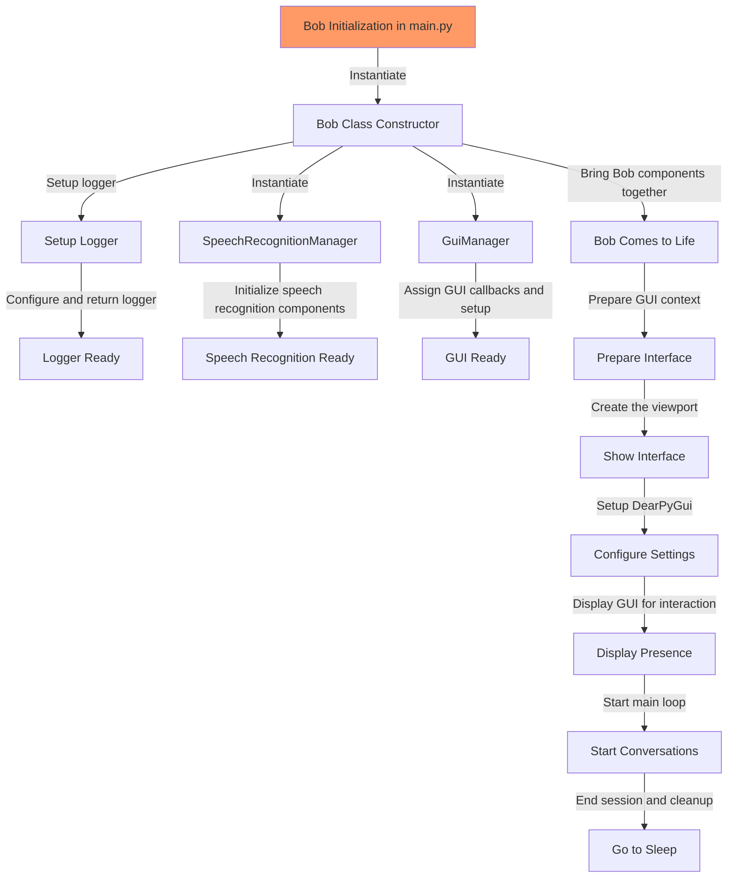

# Bob - The Virtual Assistant

This README outlines the workflow and structure of the Bob application, a virtual assistant capable of speech recognition and interaction via a graphical user interface.

## Workflow Description

Bob is a sophisticated virtual assistant that utilizes speech recognition to interact with users. The application is initialized in `main.py`, where Bob is brought to life. This process includes setting up logger for diagnostic messages, starting the speech recognition manager with callback functions for audio processing, and configuring the GUI. Bob is then ready for interaction and will process and respond to voice commands until instructed to shut down.

## Code Flow Diagram

The following diagram illustrates the overall code architecture and workflow of Bob:

## Function Call Flow

Below is the process detailing the function calls and Bob's setup sequence:

- `Bob()` (`__init__(self)`) [main.py -> bob.py]
    - `setup_logger()` [bob.py -> logger_manager.py]
    - `SpeechRecognitionManager(self.process_heard_audio, self.logger)` [bob.py -> speech_recognition_manager.py]
    - `GuiManager(self.start_listening, self.stop_listening, self.command_callback)` [bob.py -> gui_manager.py]
- `come_to_life()` [bob.py]
    - `prepare_interface()` [Creates DearPyGui context]
    - `show_interface()` [Creates viewport]
    - `configure_settings()` [Sets up DearPyGui with the context]
    - `display_presence()` [Shows the viewport and sets up the GUI]
    - `start_conversations()` [Starts the DearPyGui main loop]
    - `go_to_sleep()` [Destroys the DearPyGui context]

## Details of Key Components

- `setup_logger()`: Configures a logger to output diagnostic messages to both the console and a log file.
- `SpeechRecognitionManager()`: Manages the core speech recognition functionality, including the continuous background listening and processing of audio streams.
- `GuiManager()`: Handles the setup and layout of the graphical user interface, connecting user actions with the appropriate callback functions.
- `come_to_life()`: Orchestrates the steps to initialize and run the Bob application, preparing for user interaction, and eventually shutting down cleanly.
